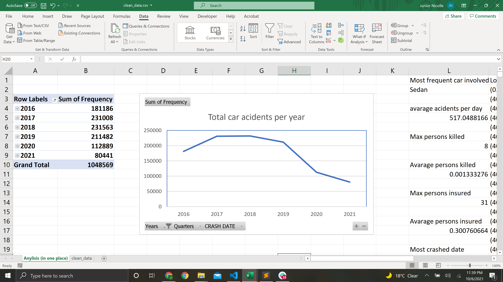

# Data: Motor Vehicle Collisions
I selected the vehicle collision data from [ NYC Open Data](https://data.cityofnewyork.us/Public-Safety/Motor-Vehicle-Collisions-Crashes/h9gi-nx95/data) published by New York City agencies and other partners. The original data was downloadable in a variety of formats so for simplicity I downloaded it as a CSV file. However, since there were millions of rows dating back from 2012 I had a hard time opening it in Excel. Specifically, when running analysis my computer often froze resulting in the programming crashing, thus, losing all my analysis. I did want to keep most of the data so I could analyze how the number collisions changed over the years, however, I had to at least remove some of the columns to make the file smaller. I, therefore, munged it into a clean CSV file by only writing the specific columns I required to do my analysis: "writer.writerow((r[0], r[1], r[2],...))".

In Excel itself, I had to furthermore prepare the data in order to do the analysis Firstly, the data only shows a single accident and its date but I wanted to analyze the total collisions each day. Therefore, I first counted the frequency of each date, then removed duplicates, and then sorted it from old to new. This way It clearly shows how many collisions occurred every day. Similarly, for locations, I wanted to make a heatmap to show collision hotspots. In order to prepare the data for this, I again counted its frequency, removed duplicated, and sorted it as seen in the table bellow.

| Location               | Frequency |
|------------------------|-----------|
| (40.861862, -73.91282) | 684       |
| (40.675735, -73.89686) | 443       |
| (40.84519, -73.9112)   | 307       |
| (40.820305, -73.89083) | 467       |
| (40.658577, -73.89063) | 401       |
| (40.696033, -73.98453) | 646       |
| (40.64254, -73.87652)  | 241       |

Additionally, in order to make a heatmap, the long and latitude had to be in different columns which I achieved by "split text" by comma in another column and deleting the unnecessary parenthesis by replacing them with blanks.

| Lat       | Long      | Frequiency |
|-----------|-----------|------------|
| 40.861862 | -73.91282 | 684        |
| 40.675735 | -73.89686 | 443        |
| 40.84519  | -73.9112  | 307        |
| 40.820305 | -73.89083 | 467        |
| 40.658577 | -73.89063 | 401        |
| 40.696033 | -73.98453 | 646        |
| 40.64254  | -73.87652 | 241        |

## Analysis
I was able to conclude many assumptions I had, starting with the most frequent vehicle type in a collision being a sedan, which makes sense as its also the most popular vehicle type in the US. There is an average of 517 collisions a day with an injury rate of 30.07% of which 1.33% are fatal. The most collisions in a single day occurred on 11/15/2018 with a total of 1065 (although California faced many wildfires during that time I couldn't find any major disruptions in New York.
The most frequent location (based on long/lat) is on the I87 by the Fordham Rd exit having had a total of 684 collisions since 2016. Below you can see a heatmap of collision hot spots in New York City:

On a positive note, the number of collisions in NYC has been rapidly decling by 20% each year since 2018. As shown in the line graph bellow it has decreased from approximately 225000 collisions in 2018 to 75000 in 2020.

## Extra-credit
I believe this assignment deserves extra credit because I did an in-depth analysis of over 1,048,576 rows which resulted in Excel crashing multiple times. I have also gone beyond the instructions to learn how to pinpoint long/lat locations on a 3d map in excel to show the collision hotspots, Lastly, I used complex formulas, along with completely sorting my data differently, such as =INDEX(rng,MODE(MATCH(rng,rng,0))) to find the most occurring string and =SUM(IF) to find the frequency of the string.